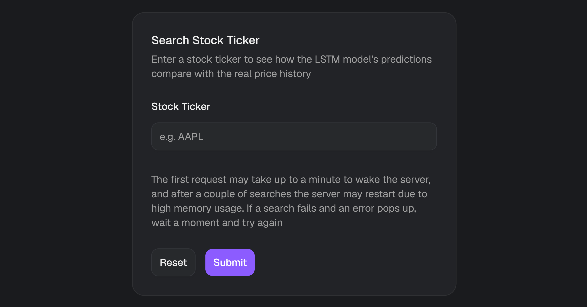
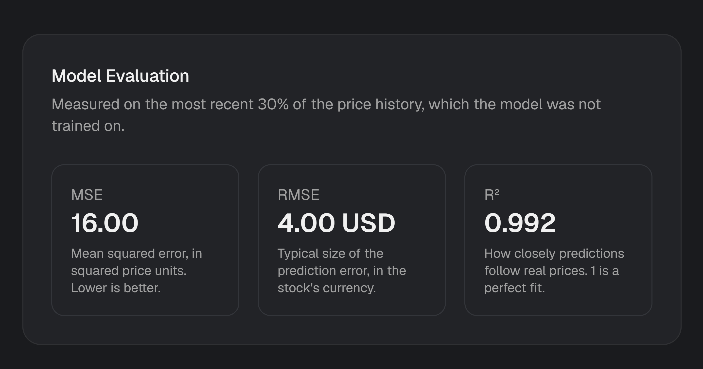
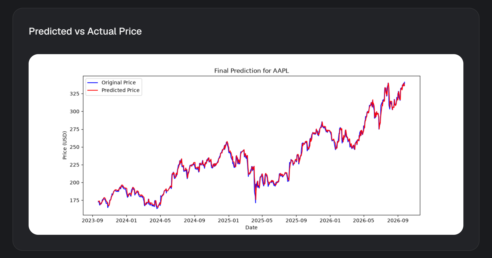
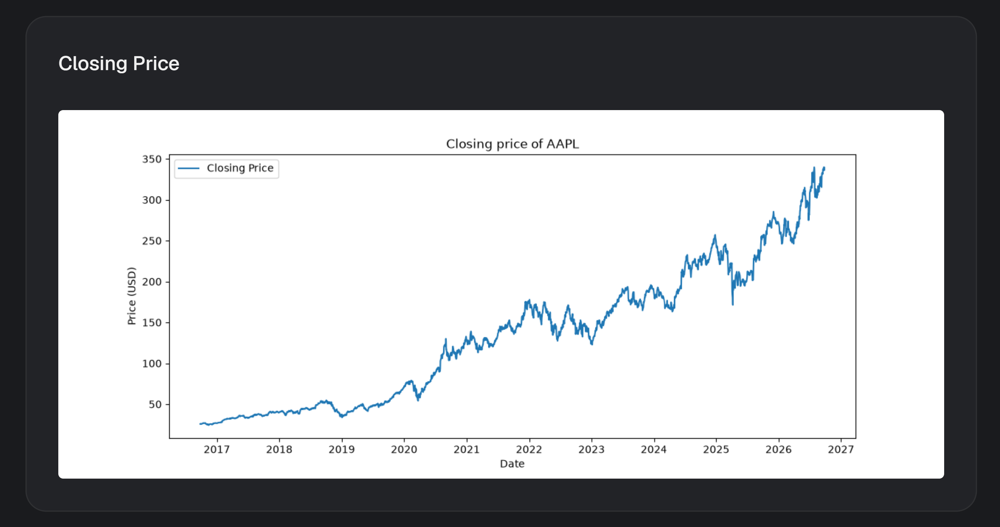
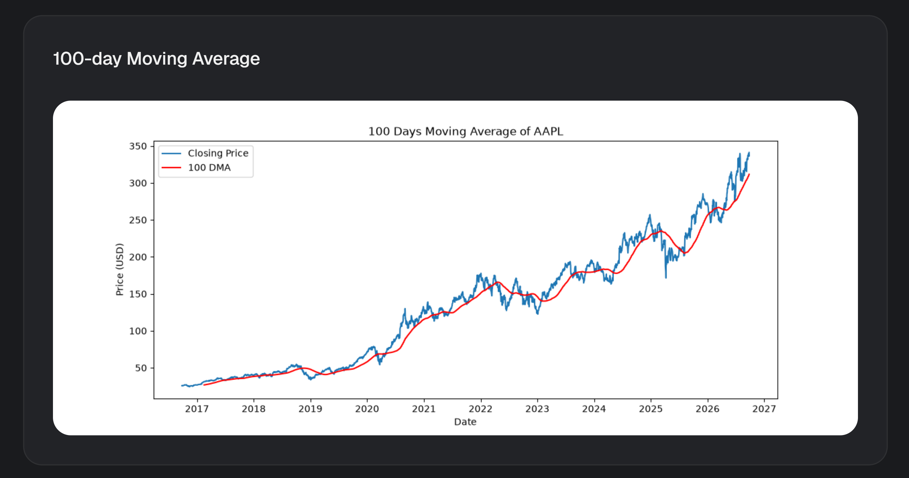
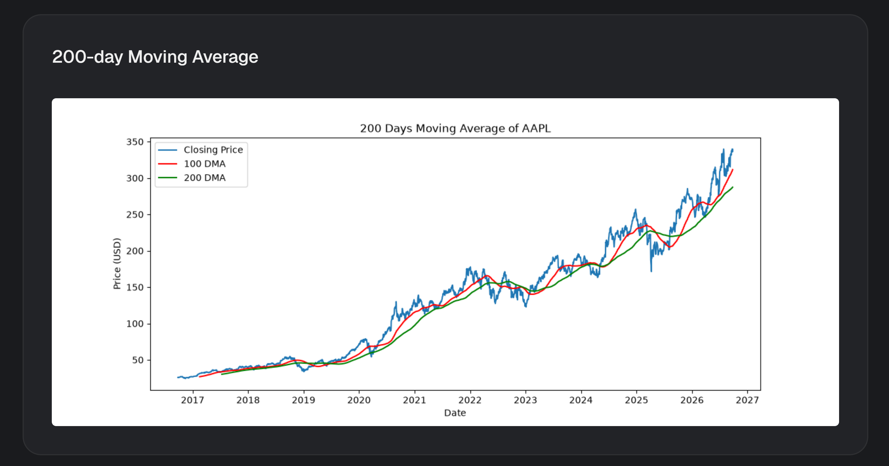

# Stock Prediction App

**Live site:** [hk-stockprediction.vercel.app](https://hk-stockprediction.vercel.app/)

This stock prediction application integrates an LSTM model built with Keras within a Django REST Framework backend and a React frontend. It evaluates the model's predictions against historical price data, alongside 100-day and 200-day moving averages, indicators commonly used by analysts to gauge price trends.

**Disclaimer:** This model **does not** forecast future prices and **should not be used for real trading or investment decisions**. Relying on it for actual investments can lead to significant financial loss. It is tested by predicting each day in the most recent 30% of a stock's price history, using the preceding 100 days as input, and comparing those predictions against what actually happened.

## Try it out

A demo account is available directly from the landing page (no sign-up required). Click **Try Demo** to be signed in instantly and explore the app.

## Features

- Search any stock ticker and view model predictions against historical price data
- Model evaluation metrics (MSE, RMSE, R²) for the predicted vs actual prices
- Closing price, 100-day and 200-day moving average charts
- Predicted vs actual price chart for the most recent 30% of a stock's price history

## Screenshots

**Search Form:** enter any stock ticker to run the model against its price history.

**Model Evaluation:** MSE, RMSE and R² statistics.

**Predicted vs Actual Price:** the model's predictions for each day in the test period, compared against what actually happened.

**Closing Price:** ten years of historical closing prices for the searched ticker.

**100-day Moving Average**

**200-day Moving Average**

## How the model works

The model was trained on ten years of historical closing prices, split 70:30 into training and testing sets, in chronological order so the model is never trained on data from after the period it is tested on.

During training, for each day in the training set, the model was given the closing prices of the preceding 100 days and trained to predict that day's closing price. Its prediction was then compared against the actual price, and the difference was used to help optimise the model.

At evaluation time, the model makes predictions the same way: for each day in the test set, it takes the preceding 100 days of closing prices as input and predicts that day's closing price, which is then compared against the actual price to produce the metrics and charts shown above.

The Jupyter notebook in [`model/`](./model) explains the model building, training and prediction logic step by step, and is the basis for the Django `StockPredictionAPIView`. Please check it out for further detail.

## Main limitation of the model

As stock prices do not tend to fluctuate much day by day, the model achieves a low error largely by predicting the previous day's price as the current day's price, rather than by anticipating genuine price movements. Benchmarked against a naive baseline (assuming tomorrow's price equals today's), the model's error is comparable to the baseline's, meaning it does not reliably outperform simply persisting the previous day's price.

This is visible on the "Predicted vs Actual Price" chart: the predicted line closely follows the actual line with a slight lag, rather than anticipating turning points before they happen.
This is unsurprising as stock prices are unpredictable, meaning that there is no reliable way of predicting future stock prices based on previous stock price data 
(the model cannot factor in future events which may affect the stock market for example).

## Built with

**Frontend**
- [React](https://react.dev/)
- [TypeScript](https://www.typescriptlang.org/)
- [TanStack Query](https://tanstack.com/query): data fetching and caching
- [Axios](https://axios-http.com/): API client
- [React Router](https://reactrouter.com/): routing
- [React Hook Form](https://react-hook-form.com/) & [Zod](https://zod.dev/): form state management and schema validation
- [Tailwind CSS](https://tailwindcss.com/): styling
- [shadcn/ui](https://ui.shadcn.com/) UI components

**Backend**
- [Django](https://www.djangoproject.com/) & [Django REST Framework](https://www.django-rest-framework.org/)
- [djangorestframework-simplejwt](https://django-rest-framework-simplejwt.readthedocs.io/): JWT authentication
- [django-cors-headers](https://github.com/adamchainz/django-cors-headers): CORS handling
- [python-decouple](https://github.com/HBNetwork/python-decouple): environment variable management

**Model**
- [yfinance](https://github.com/ranaroussi/yfinance): historical price data
- [Keras](https://keras.io/) / [TensorFlow](https://www.tensorflow.org/): LSTM model
- [scikit-learn](https://scikit-learn.org/): data scaling and evaluation metrics
- [pandas](https://pandas.pydata.org/) & [NumPy](https://numpy.org/): data processing
- [Matplotlib](https://matplotlib.org/): chart generation
